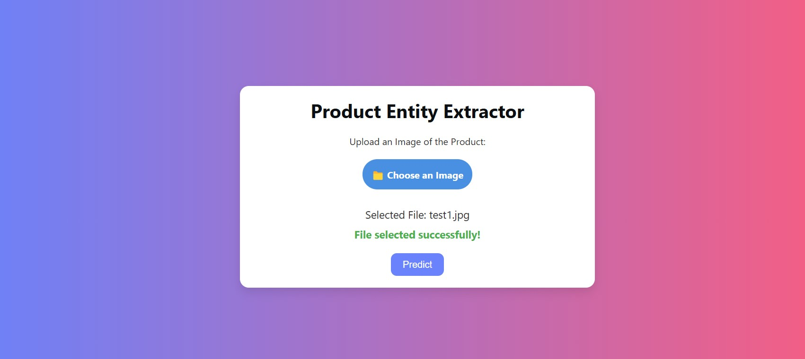
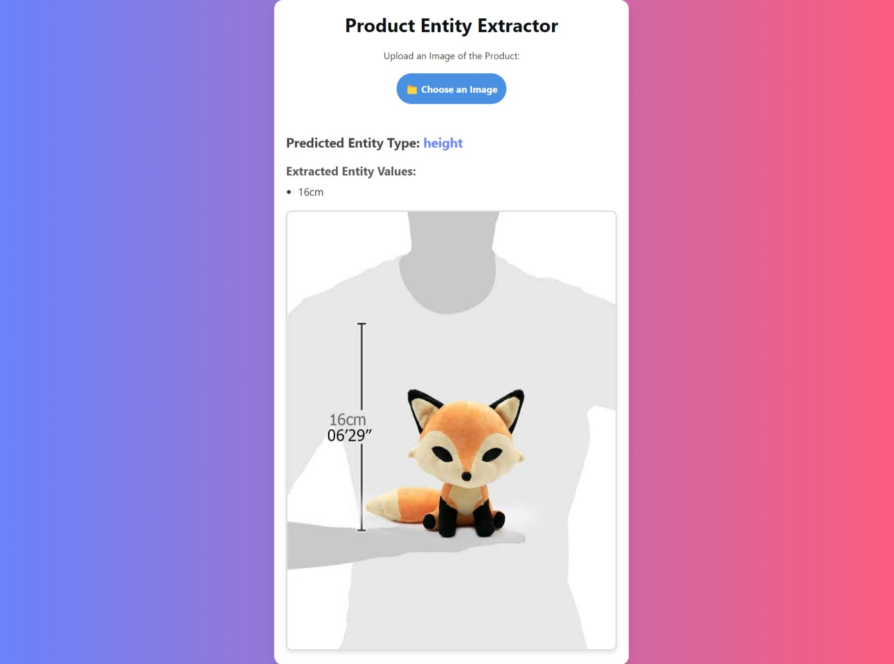

# InsightXtract App

InsightXtract is a Flask-based web application designed to extract **entity types** (e.g., height, weight) and their **corresponding values** (e.g., 50g, 180cm) from product images. The app uses a trained machine learning model (using neural network) for entity extraction and value prediction.

---

## Features

- Extracts entity types like `weight`, `height`, etc., and their values from uploaded product images.
- Uses a pre-trained model `EfficientNetB0` to create our own trained model (`model22f.keras`) for prediction.
- Provides sample test images (`test1.jpg` and `test2.jpg`) for users to test the functionality.
- Built on the Flask framework with a simple, user-friendly interface.

---

## Dataset

- The dataset used for training includes:
  - **CSV Files:** Metadata and labels for model training.
  - **NPZ Files:** Containing grouped data used to create the `mergedData.npz` file.
  - The `mergedData.npz` file is the primary input for the model training process.

- A Google Drive link is available to download the dataset, which includes both CSV and NPZ files. Ensure you download and place them in the appropriate folder before running the training scripts.
- [Dataset](https://drive.google.com/file/d/1JdawdgUi-MdwoTV912zfM7HQv20iaaoo/view?usp=sharing)

---

## Model Information

### Current Model
- The trained model (`model22f.keras`) is used for predictions in the application.
- It was created using the notebook `model2UsingPreTrained.ipynb`.
- This model is stored in the `savedModel/` folder for easy access during runtime.

### Improved Model (In Progress)
- A newer, experimental model is being developed using the notebook `BetaModel3UsingPretrained.ipynb`. This model aims to enhance prediction accuracy and overall performance.
- The improved model is not yet integrated into the application.

---

## How to Use

1. **Install Requirements:** Ensure you have Python 3.8+ and necessary Python packages (Flask, TensorFlow/Keras, NumPy, etc.) installed.
2. **Run the Application:**
   - Navigate to the `website` folder and run the Flask app.
   - Access the app in your browser at `http://127.0.0.1:5000`.
3. **Test the Application:**
   - Use the sample test images (`test1.jpg` and `test2.jpg`) provided in the project.
   - Or upload your own product images for predictions.

---

## Sample Output Screenshots

### Prediction Example
Here are some screenshots demonstrating the application's output:

#### Input Image

#### Predicted Output

---

## Future Enhancements

- **Model Improvements:** Integrate the newer model once it’s finalized.
- **Authentication:** Add a secure login and authentication system for the application.
- **Cloud Integration:** Migrate storage to cloud platforms like AWS S3 or Google Cloud for scalability.
- **Dataset Expansion:** Add more diverse data for improved model generalization.

---

## License

This project is licensed under the MIT License. See the `LICENSE` file for more details.

---

## Contact

For any queries or contributions, feel free to reach out:

- **Author:** Anmol Chadha
- **Email:** [anmolchadha226@gmail.com
](mailto:anmolchadha226@gmail.com)
